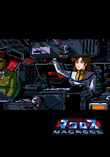
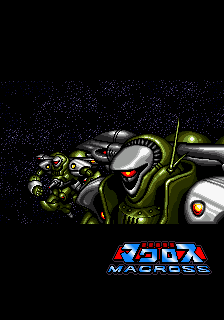
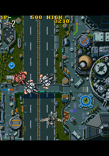
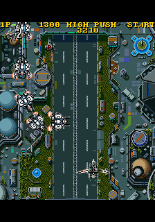

# Macross Ver.26 Super Spacefortress Macross FPGA Core for Analogue Pocket

An FPGA implementation of the NMK16-derived arcade hardware used by **Super Spacefortress Macross** (*Chō Jikū Yōsai Macross*, Banpresto / NMK, 1992) for the **Analogue Pocket openFPGA platform**.

Ver.26 is the project's frozen Stage26 baseline, presented as **0.26.0**, dated **2026-10-03**. The work brings together the 68000 main CPU, NMK004 sound controller, tile and sprite rendering, graphics transformation, audio, memory arbitration, and Pocket integration.

**Publication status:** source and binary distribution remain subject to the licensing and provenance review described in [docs/LICENSING.md](docs/LICENSING.md). This repository is being prepared as the public source, tooling, documentation, and release home for the project.

Community testing is welcome and valid bug reports may reopen the project to those who report them. See [Testing and project status](docs/TESTING.md).

## Screenshots










## Scope and status

The supported development target is **Super Spacefortress Macross** on Analogue Pocket.

NMK16 describes the broader arcade hardware family and informs the architecture and documentation in this repository, but support for other NMK16 games is **not currently claimed**. “Core” refers to the FPGA hardware implementation. This repository contains the source, tooling, documentation, and release material surrounding that core.

The frozen production baseline has 24 authenticated source and constraint files. Saved Stage26 reports record 108 timing checks, minimum slack **+0.131 ns**, **9,940 ALMs**, and **301 RAM blocks**. These are historical results for the saved fit, not a new compilation of this publication tree.

Retained verification records report passing sprite-pressure, background-map ownership, and text-timeline stress checks, plus compilation of the final integrated machine harness. Publication preparation rechecked source and artifact hashes; it did not rerun Quartus, the full-game simulation, or physical hardware testing.

Final motion evidence supports freezing Ver.26. It does not establish exact optical generation, repeat, or drop counts for every displayed frame. Claims of hardware and cycle accuracy should therefore be understood within those documented limits.

Ver.26 expects `macross.rom`, **5,980,704 bytes**, with SHA-256:

```text
209700c2b4d0722e39eb2c395f13fe08903aaf315e1cbac3fab78ddd3c903e59
```

The expected SD-card location is:

```text
Assets/mycore/common/macross.rom
```

See [docs/ROMS.md](docs/ROMS.md) for the byte layout and current reproduction limits.

The inherited `mycore.mra` is an unfinished template and must not be used as a Macross ROM assembly recipe.

## Install a reviewed release

The saved release package contains 13 files.

The compatibility identity remains `plasticbugs.Macross A7`, with platform ID `mycore`, while the displayed project name is **Macross Ver.26**.

These inherited identifiers preserve the existing package and Settings relationship; they are not a claim that the current project contributors own that namespace. Metadata currently retains the upstream template URL. A future metadata correction would produce a different package checksum.

| Control | Pocket button |
|---|---|
| Movement | D-pad |
| Button 1 | A or Y |
| Button 2 | B or X |
| Coin | Select |
| Start | Start |

Package metadata specifies openFPGA framework **1.1** as its minimum, a **320 × 224** Pocket source/scaler image, and **270° rotation**. This is the Pocket presentation geometry; the native Macross game content remains **256 × 224**.

The package declares Dock support and disables sleep. Those declarations are not an exhaustive compatibility test matrix.

Menu options include screen shape, scanlines, shadow mask, service switch, and diagnostic memory-stress controls. Leave diagnostic controls off for ordinary play.

## Build and reproduce

The maintained build entry points are:

```sh
sh build-local.sh map
sh build-local.sh
```

The full build runs the timing gate and packages `release/pocket/`.

`python3 package-pocket.py` can package existing fitted outputs, but it is not a substitute for a fresh build after changing HDL or constraints.

The present build requires Docker and the local image `openfpgaos-quartus-full:latest`, containing **Quartus Prime 25.1std.0 Build 1129**.

The public repository still needs a fully pinned, reproducible description of that build environment. External Verilator **5.052**, a C++ toolchain, and Make are used by the simulation workflow.

See [docs/BUILD.md](docs/BUILD.md) for configuration, ROM-free checks, and remaining build-environment work. For dependencies or generated components that are intentionally withheld pending license/provenance review, see [docs/DEPENDENCIES.md](docs/DEPENDENCIES.md) for where they belong and how to obtain, regenerate, or replace them.

## Architecture

The core uses:

- FX68K for the Motorola 68000-compatible main CPU
- a project-written TLCS-90 / NMK004 implementation for sound control
- JT03 / JT49 for YM2203-compatible sound
- two JT6295 instances for OKI ADPCM playback
- project-specific background, sprite, text, palette, and presentation logic
- Pocket glue for loading, memory interfaces, display processing, controls, and audio output

The video path combines background tiles, sprites, text, and palette presentation while preserving the native game's temporal behavior across the Pocket display domain.

See [docs/ARCHITECTURE.md](docs/ARCHITECTURE.md) for the hardware model and implementation notes.

## Repository layout

```text
README.md                  Project overview and user entry point
LICENSE                    Project-owned code license, after review
CREDITS.md                 Project and upstream acknowledgments
THIRD_PARTY.md             Component provenance and license map
.gitignore                 Private input and generated output exclusions

docs/                      Build, architecture, ROM contract, licensing, validation
rtl/                       Macross machine, renderers, presenters, diagnostics
target/pocket/             Pocket core wrapper, memory, PLL configuration
platform/pocket/           Reviewed platform sources with upstream notices
modules/                   CPU and sound cores; project NMK004 implementation
projects/                  Quartus project and constraints
pkg/pocket/                ROM-free Pocket package metadata and text
sim/                       Reviewed source-only tests, including Stage26 checks
tools/                     Build-environment and validation utilities
manifests/                 Public source and package integrity manifests
```

Generated outputs, private fixtures, historical workspaces, runtime binaries, ROMs, research media, and preservation archives belong outside the published repository.

Reviewed release binaries should be distributed as GitHub Release assets rather than committed as source files.

## Frozen Ver.26 integrity

| Artifact | SHA-256 |
|---|---|
| `Stage26-bitstream.rbf_r` | `e71cdf822157772146f96bee032b1411cfb4b7e7051093ae2e346b91ed37513c` |
| `Macross-Ver26-Stage26-Pocket.zip` | `eb4473afa393fc478e41ce5c99b7ad42f705d7eca32ddb7c46bc99ca2cc811be` |
| Original 24-file production manifest | `2ae6a2ca41944ea0efb4dc98eee1e4aba118eaa07fbb07e68a144c6e82058445` |

The saved bitstream is **1,957,416 bytes**. The saved package ZIP is **697,259 bytes**.

A ZIP repack can change the archive hash without changing its member bytes. Keep the frozen archive hash separate from source reproducibility and future metadata revisions.

Full source hashes and all 12 package-member hashes belong under [manifests/](manifests/).

## Validation philosophy

Development followed an evidence-first process:

**OBSERVE → PROVE → EXPLAIN → CHANGE → RETEST**

Later stages focused heavily on temporal presentation correctness rather than simply producing a playable image.

Examples include:

- Stage23 — scroll-domain presentation
- Stage24 — sprite-frame coherency
- Stage25 — palette-timeline preservation
- Stage26 — text and background temporal coherency
- final physical motion review — native refresh-conversion judder identified and intentionally left unchanged

The final release was frozen when remaining visible motion behavior was shown to be consistent with the original timing model rather than a new FPGA defect.

## Credits and licensing

**August Wong · Doctor Lucy van Pelt · Codex Jordan**

Thanks to the original game creators, Pocket template and platform contributors, Jorge Cwik for FX68K, Jose Tejada Gomez for the JT sound cores, and the MAME authors whose work informed the hardware model.

Full acknowledgments are in [CREDITS.md](CREDITS.md) and [THIRD_PARTY.md](THIRD_PARTY.md).

A project-wide license has not yet been applied.

Retain every inherited license and copyright notice. GPL components make **GPL-3.0-or-later** a practical candidate for project-owned integrated gateware, subject to confirming ownership and dependency compatibility.

See [docs/LICENSING.md](docs/LICENSING.md).

This is an independent preservation and engineering project. Game, hardware-family, and platform names are used to identify compatibility and do not imply endorsement.
